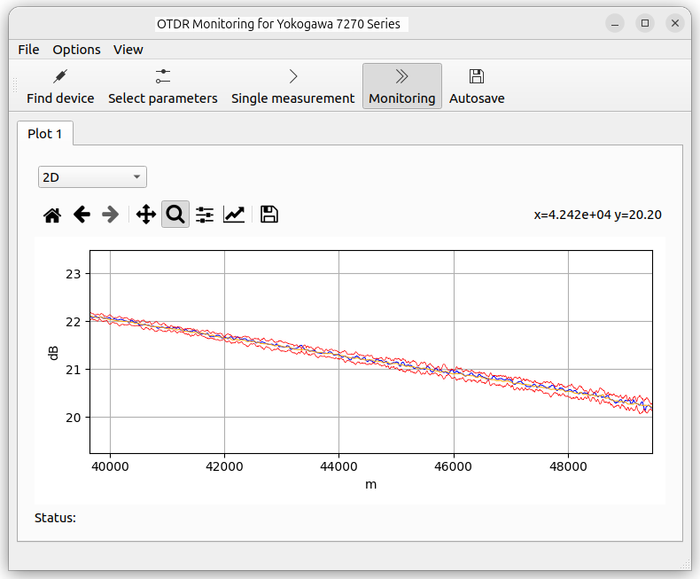

# ![logo][] OTDR Monitoring for Yokogawa AQ7270 series reflectometer

This is an extendable visualizer for Yokogawa OTDR reflectometer with GUI based on PySide (Qt). The main goal of this project is to continuously monitor the optical fiber communication line. If the reflectogram changes significantly, the program will indicate this.

The application was used to monitor optical-fiber communication line in one quantum key distribution project (QKD).

[logo]: githubicon/OTDR_Interface_with_Significant_Change_Alert.png

## Features

The software implements the following features:
- connect to the reflectometer using a USB driver;
- run measurement with a given interval;
- load data from the reflectometer;
- run plugin to check if data is changed significantly;
- alarm if data is changed significantly;
- save measurement data to the local folder;
- reconnect to the device if the connection is broken;

## Documentation

Slightly outdated documentation can be found [here](docs/manual/manual.pdf)

## Screenshot

